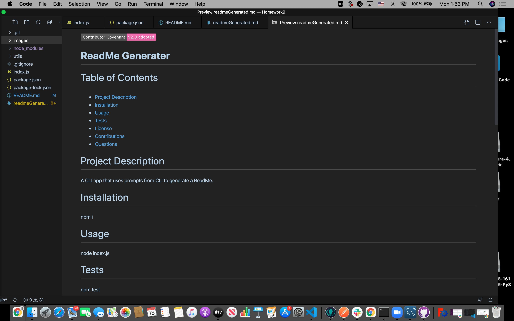

## Good Readme Generator

## Description
The following application is a command-line application that will create a "readme" file based off user input.  In order to use the application, a user
would have to navigate to where the "index.js" file is located and open up their terminal.  The application can be started by typing the following command in the
terminal and pressing the "enter" key:
Command: node index.js
